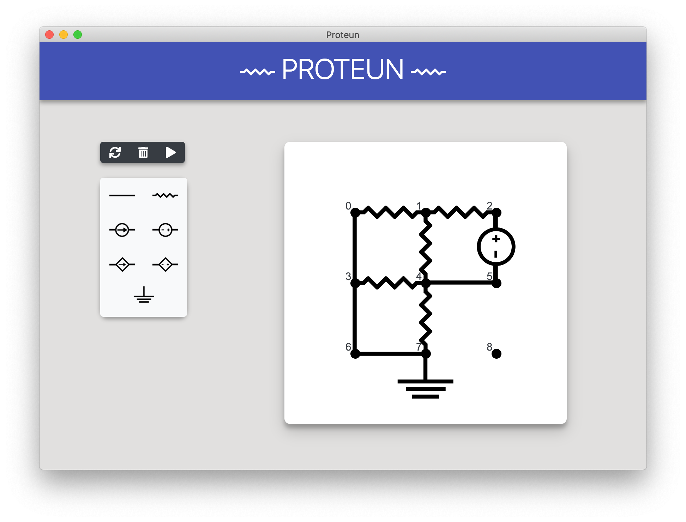

# Proteun

Simple electronic circuit analyzer.  



## Instruction
In the root directory of project  
* make sure you have nodejs on your computer.  

* Install dependencies:
```
npm install
```
* Run project:
```
npm start
```

enjoy :)

## License
[MIT](LICENSE)
